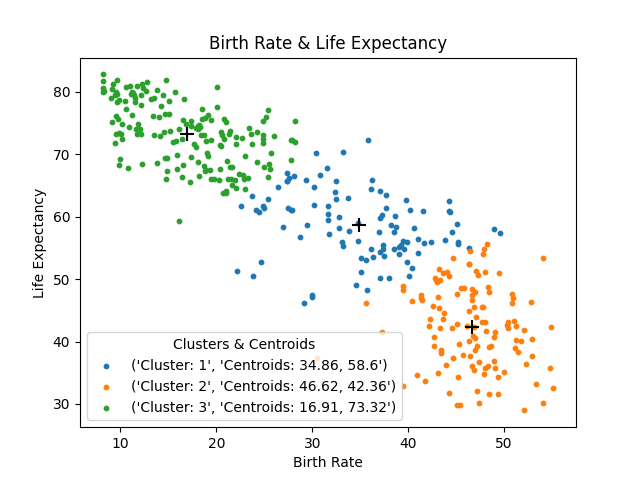

# Kmean Clustering | Birth Rate & Life Expectancy

A Python unsupervised machine learning algorithm that groups countries by distinct observations.

## Description

This program is an unsupervised K-Means algorithm that utilises the euclidean formula to plot a k number of clusters, based on the birth rate and life expectancy of countries, over a user-specified number of iterations.

The algorithm consists of the following steps:

* **Step 1: Initialise Inputs**
  * User select the ``database`` to use.
  * User inputs the ``k`` number of clusters.
* **Step 2: Initialise Procedure**
  * Extract the data from a CSV file into a list of ``data_points``
  * Initalise number of ``iterations``.
  * Choose starting values of ``centroids`` from the list of data points.
* **Step 3: Initialise Algorithm**
  * Initilaise ``cluster`` list to store the closest point to each cluster.
  * Call the ``assignCentroids()`` method to assign each data point to its nearest centroid by calculating the nearest distance from each point to each centroid in the ``calcDistance()`` method.
  * Call the ``calcMean()`` method to compute the ``x_mean`` and ``y_mean`` for the next iteration of centroids.
  * Repeat step 3 for the amount of iterations.
* **Step 4: Display Results**
  * Call ``printInfo()`` function to print the list of countries in each iteration together with the birth rate and life expectancy of each cluster.* Call ``scatterPlot()`` method to plot the results.

For a detailed explanation, see notes on *APPROACH*, *RESOURCES* and *CHALLENGES* as commented at the end of the py file.

## Insights

Convergence isn't monitored in this implementation but just a couple of iterations produces interesting insights as noted below.

See ``data for interpretation.txt`` file for the data that was analysed for these insights.

**1. Insights from 3 clusters on the ``data1953.csv`` and ``data2008.csv`` datasets separately:**

*Birth Rate & Life Expectancy of 1953 with 3k*


*Birth Rate & Life Expectancy of 2008 with 3k*


* Clusters with a lower birth rate have a longer life expectancy, and clusters with a higher birth rate have a shorter life expectancy.
* The clusters are segmented into predominantly first world countries, having a higher life expectancy, to third world countries, having a lower life expectancy.
* While the global life expectancy between 1953 and 2008 has improved, there are several developing countries like Afghanistan and Somalia for example whose life expectancy has not improved, likely due to the economic and political climate.

**2. Insights from 4 clusters on the ``dataBoth.csv`` file:**


* Cluster 1, with low life expectancy and high birth rate, is made up mostly of 1953 countries with a few 2008 countries. The countries with the 2008 data are also present, in the same cluster, for the 1953 data. The conclusion drawn from this observation is that these contries that have not progressed and remained at the same high life expectancy to birth rate ratio. They have regressed in terms of their development.
* Cluster 4, with high life expectancy and low birth rate, is made up mostly of 2008 countries with a few 1953 countries. The countries with the 1953 data are also present, in the same cluster, for the 2008 data. The conclusion drawn from this observation is that these countries have attained and maintained a high life expectancy to birth rate ratio with no further progression. They have reached a critical mass in terms of their development.

## Programming principles

This program employs the programming concepts of algorithms together with functions, external IO databases, conditional logic, the Java Collections Framework and matplotlib.

## Dependencies

The three .csv files that contain the data:

* data1953.csv
* data2008.csv
* dataBoth.csv

Import libraries:

* ``import csv`` *(for reading file)*
* ``import matplotlib.pyplot as plt`` *(for plotting)*
* ``import random``  *(for randomising initial centroids)*
* ``from math import sqrt`` *(for calculating square root)*

## Running the program

Run the kmeans.py file in any Python IDE together with the .csv files in the same folder.

## Code preview

```python
# ----- Initialise Algorithm ----- #
for iteration in range(iterations):

    # Initilaise cluster list to store the closest point to each cluster.
    clusters = [[] for cluster in range(k)]

    # Call function to assign each data point to its nearest centroid.
    print(f"\n--- Assign data points for iteration {iteration +1} ---\n") 
    for points in data_points:
        assignCentroids(calcDistance, k, centroids, clusters, points)

    # Call function to compute the mean for the new centroids.
    print(f"\n--- Compute centroids for iteration {iteration +1} ---\n") 
    for cluster in range(k):
        centroids[cluster] = calcMean(clusters[cluster])
        
        print(f"New centroid {cluster +1} at {round(centroids[cluster][0],2)}, {round(centroids[cluster][1],2)}")
```

## Program input preview

```text
----- Birth Rate & Life Expectancy Clustering -----

Database:
1. data1953.csv
2. data2008.csv
3. dataBoth.csv

Enter the number of the file to use: 3
Enter the number of groups to cluster: 3
```

## Program output preview



```text
----- Clustering Results -----

--- Cluster 1 Data ---

Centroids:
x(34.86), y(58.6)

Data points in cluster:
[[39.599, 54.86], [27.349, 65.701], [24.676, 52.812], [34.581, 49.054], [24.89, 61.736], [37.113, 50.194], [32.746, 59.882], [34.744, 56.187], [35.127, 53.328], [28.687, 56.784], [38.027, 50.2], [37.283, 60.272], [38.558, 57.481], [27.483, 61.391], [36.993, 57.522], [32.507, 62.88], [33.25, 70.447], [39.88, 52.692], [27.852, 61.106], [31.585, 67.812], [39.026, 55.179], [27.612, 66.237], [29.112, 46.119], [38.556, 54.77], [36.191, 65.856], [40.455, 51.866], [33.798, 57.711], [27.8, 61.112], [40.134, 50.497], [30.209, 64.709], [31.684, 61.683], [41.033, 54.252], [32.399, 63.935], [38.776, 58.348], [30.79, 66.656], [22.113, 51.37], [31.616, 60.485], [30.014, 47.391], [28.139, 66.581], [41.648, 55.821], [40.201, 61.095], [33.058, 55.915], [30.443, 70.151], [35.855, 72.274], [37.1, 64.176], [30.028, 47.199], [39.28, 55.438], [25.423, 62.814], [33.7, 63.009], [44.281, 60.98], [40.6, 58.168], [38.6, 60.109], [32.8, 58.173], [49.56, 57.426], [37.09, 54.379], [48.94, 58.077], [36.094, 54.909], [44.622, 57.576], [22.61, 61.661], [31.602, 59.429], [27.4, 66.959], [36.37, 53.583], [24.4, 60.802], [39.829, 62.678], [39.0, 54.068], [31.8, 57.228], [37.7, 63.429], [32.5, 65.716], [34.8, 59.001], [23.751, 63.37], [33.2, 55.247], [23.8, 50.534], [35.759, 48.222], [45.2, 55.996], [35.6, 53.109], [41.0, 56.368], [37.7, 61.332], [37.35, 55.45], [45.194, 55.677], [29.32, 65.88], [39.5, 56.15], [29.45, 58.644], [41.6, 60.997], [35.11, 51.209], [39.893, 56.016], [44.244, 62.6], [30.14, 61.918], [24.09, 61.12], [36.16, 64.471], [46.3, 54.989], [24.94, 61.337], [26.455, 64.693], [37.361, 54.825], [26.97, 58.405], [44.4, 60.71], [27.41, 65.66], [37.453, 53.672], [43.8, 56.313], [45.137, 58.831], [38.2, 58.615], [42.433, 56.014], [37.097, 59.743]]

Number of countries:
102

Countries in cluster:
['(2008)Benin', '(2008)Bolivia', '(2008)Botswana', '(2008)Burundi', '(2008)Cambodia', '(2008)Cameroon', '(2008)Comoros', '(2008)Congo  Rep.', "(2008)Cote d'Ivoire", '(2008)Djibouti', '(2008)Equatorial Guinea', '(2008)Eritrea', '(2008)Ethiopia', '(2008)Gabon', '(2008)Gambia', '(2008)Ghana', '(2008)Guatemala', '(2008)Guinea', '(2008)Haiti', '(2008)Iraq', '(2008)Kenya', '(2008)Laos', '(2008)Lesotho', '(2008)Liberia', '(2008)Madagascar', '(2008)Malawi', '(2008)Mauritania', '(2008)Namibia', '(2008)Nigeria', '(2008)Pakistan', '(2008)Papua New Guinea', '(2008)Rwanda', '(2008)Sao Tome and Principe', '(2008)Senegal', '(2008)Solomon Islands', '(2008)South Africa', '(2008)Sudan', '(2008)Swaziland', '(2008)Tajikistan', '(2008)Tanzania', '(2008)Timor-Leste', '(2008)Togo', '(2008)Vanuatu', '(2008)West Bank and Gaza', '(2008)Yemen  Rep.', '(2008)Zimbabwe', '(1953)Albania', '(1953)Argentina', '(1953)Armenia', '(1953)Aruba', '(1953)Azerbaijan', '(1953)Bahamas', '(1953)Barbados', '(1953)Belize', '(1953)Bosnia and Herzegovina', '(1953)Brunei', '(1953)Chile', '(1953)Costa Rica', '(1953)Croatia', '(1953)Cuba', '(1953)Cyprus', '(1953)French Guiana', '(1953)Georgia', '(1953)Grenada', '(1953)Guadeloupe', '(1953)Guam', '(1953)Hong Kong  China', '(1953)Israel', '(1953)Jamaica', '(1953)Japan', '(1953)Kazakhstan', '(1953)Korea  Dem. Rep.', '(1953)Korea  Rep.', '(1953)Kuwait', '(1953)Kyrgyzstan', '(1953)Lebanon', '(1953)Macao  China', '(1953)Macedonia  FYR', '(1953)Malaysia', '(1953)Malta', '(1953)Martinique', '(1953)Moldova', '(1953)Netherlands Antilles', '(1953)New Caledonia', '(1953)Panama', '(1953)Paraguay', '(1953)Poland', '(1953)Portugal', '(1953)Puerto Rico', '(1953)Qatar', '(1953)Romania', '(1953)Russia', '(1953)Saint Lucia', '(1953)Serbia', '(1953)Singapore', '(1953)Slovak Republic', '(1953)Sri Lanka', '(1953)Suriname', '(1953)Tonga', '(1953)Trinidad and Tobago', '(1953)Uzbekistan', '(1953)Virgin Islands (U.S.)'] 

Birth rate:
34.86

Life expectancy:
58.6


--- Cluster 2 Data ---

Centroids:
x(46.62), y(42.36)

// etc etc
```

&nbsp;
***  
*The Euclidean algorithm is the granddaddy of all algorithms, because it is the oldest nontrivial algorithm that has survived to the present day.* ~ Donald Knuth
***
&nbsp;

## License

This project is licensed under the GNU GENERAL PUBLIC LICENSE.

## Author

**Megan Bisschoff** 2022

Project submitted for Software Engineering learnership Level 3 Task 22 at [HyperionDev](https://www.hyperiondev.com/)

[View](https://www.hyperiondev.com/portfolio/86596/) submission results.
